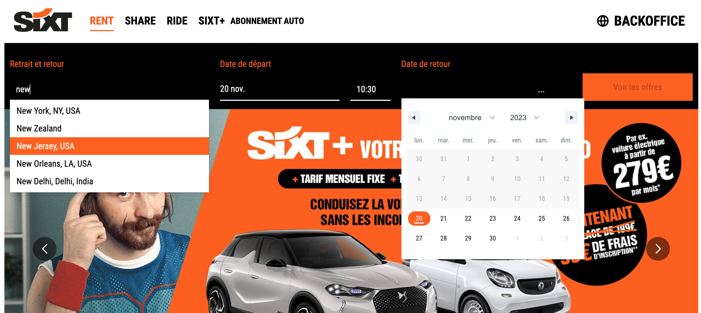
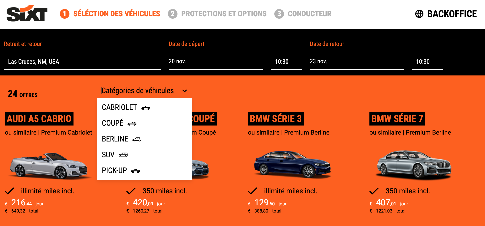
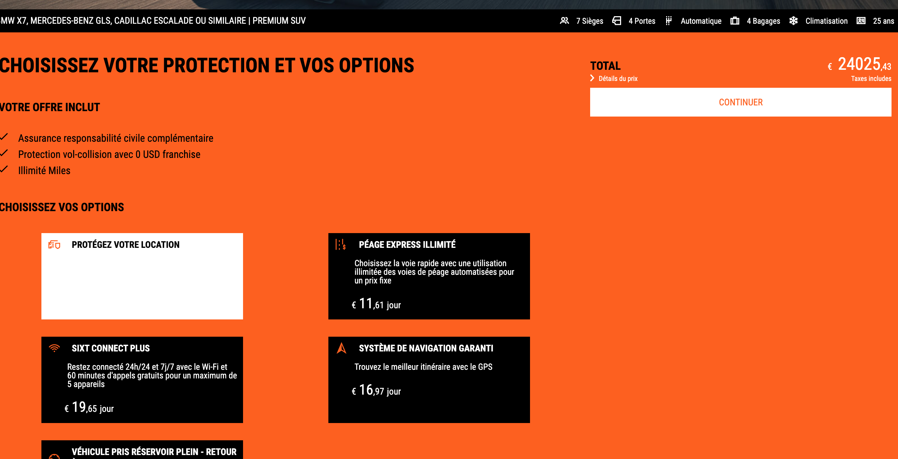
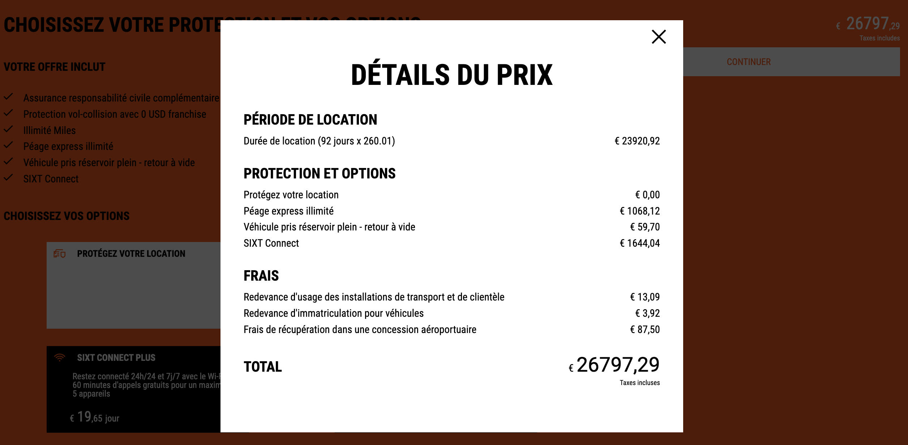
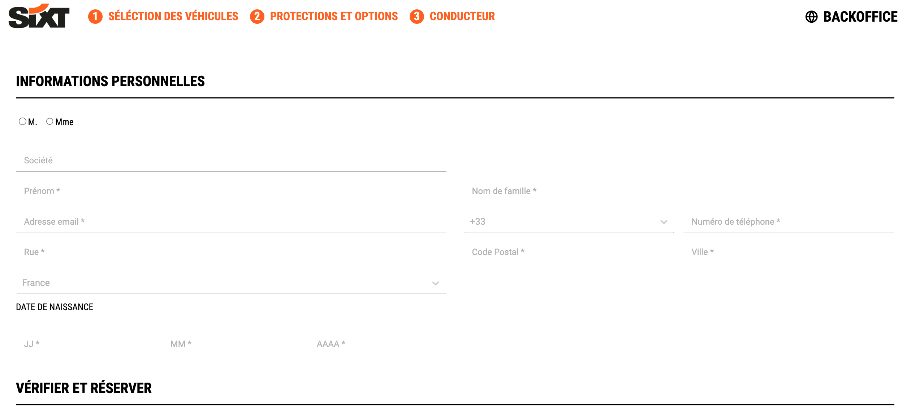
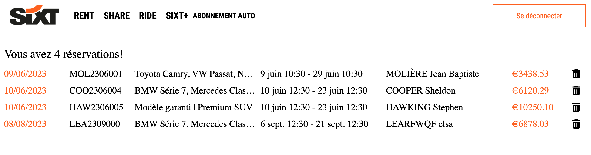

## SET UP 👨‍💻

```bash
npm install
```

or

```bash
npm i
```

to install all the packages

```bash
npm run dev
```

to start the project

open `http://localhost:5173/` in your browser, and start booking cars!

The backend repo is available [here](https://github.com/elsa-wanderlust/sixt-backend)

## ONLINE 🌏

deployed via Netlify [here](https://elsa-letallieur-sixt.netlify.app/)


server hosted on Northflank

## PROJECT 🚘 🚙 🏎


Web app reproduction of the Sixt (former) website with React and Sass for the frontend.

- On the home page : select your agency, day and time for both pick up and return.

  

- Select a type of car, of modify the original parameters - the offers and prices get updated automatically. Select your car

  

- Select amongst few options (per day, per rental), the total prices get updated, and a modal is accessible with the pricing details

  

  

- fill up the booking booking

  

- access the backoffice (pw: HelloWorld!) to see all bookings

  

Reach out [here](https://github.com/elsa-wanderlust/sixt-front/issues) if any question!
